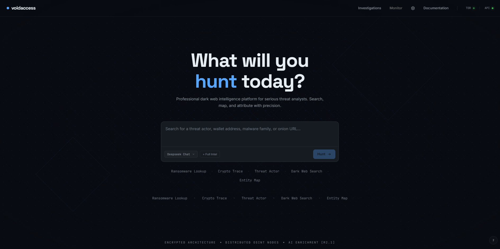
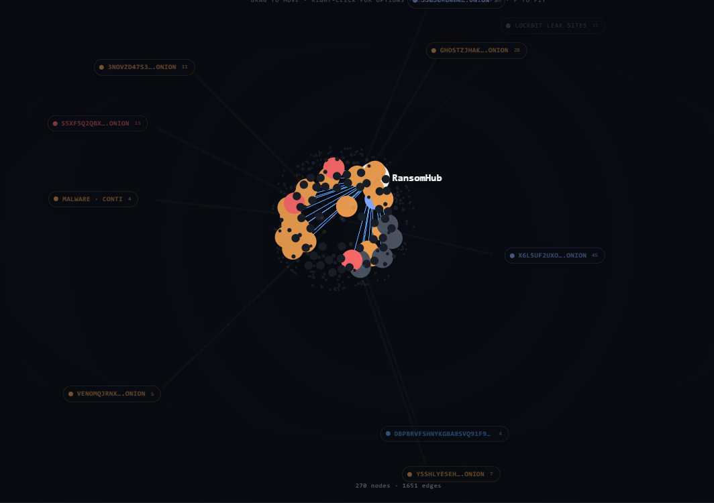
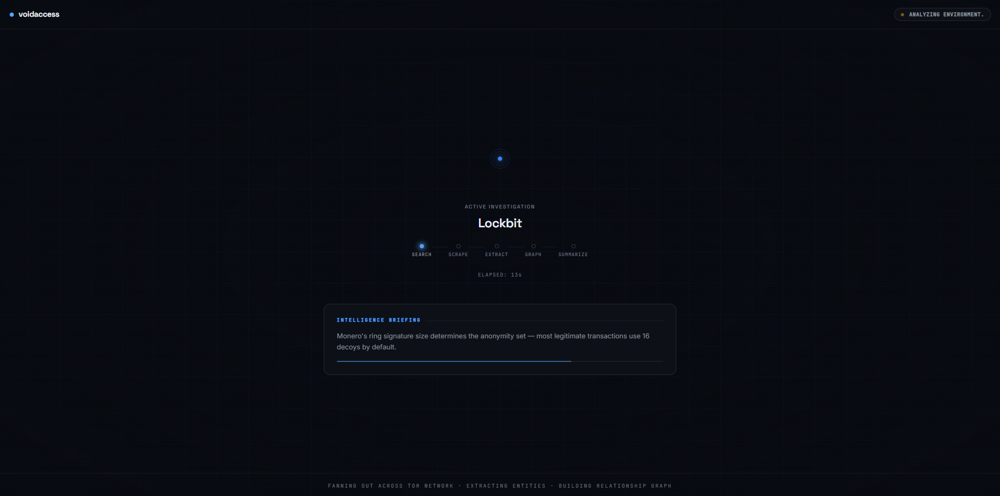
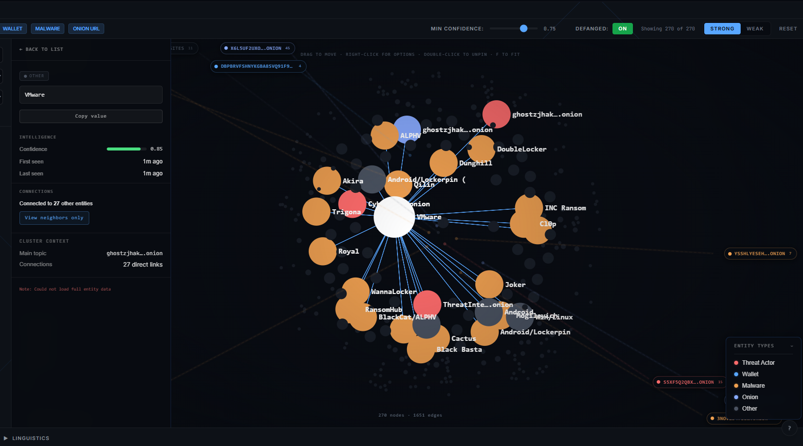
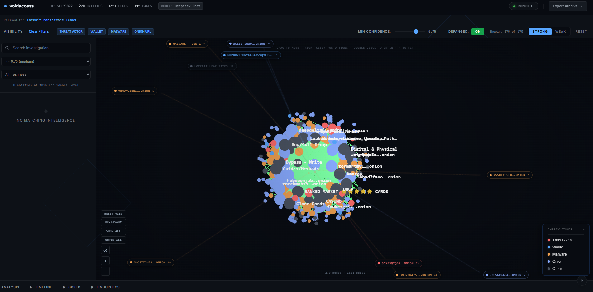

<div align="center">
  
  <h1>VoidAccess</h1>
  <p><strong>A self-hosted OSINT platform for dark web threat intelligence.</strong></p>
  <p>Automate the entire investigation workflow from query refinement to relationship mapping in 13 autonomous pipeline steps.</p>
</div>

---

## The OSINT Powerhouse

Commercial threat intelligence platforms often charge prohibitive annual fees for capabilities that can be run on private hardware. **VoidAccess** democratizes high-end dark web intelligence by providing an automated, end-to-end workflow:

- **Query Refinement**: Intelligent search term optimization using LLMs.
- **Multilingual Search**: Deep-web fan-out across English, Russian, and Chinese engines.
- **Entity Extraction**: Autonomous identification of wallets, IOCs, PGP keys, and more.
- **Relationship Mapping**: Dynamic graph generation from extracted data co-occurrence.
- **Structured Export**: STIX 2.1, MISP, Sigma, and CSV support.

---

## Visual Walkthrough

### 1. Intuitive Dashboard
Start investigations with a clean, dark-themed interface designed for high-stakes research.


### 2. Intelligent Scoping
Refine queries and select investigation depth with precision.


### 3. Real-time Pipeline Tracking
Monitor the 13-step autonomous pipeline as it crawls and extracts intelligence.


### 4. Interactive Graph Intelligence
Explore connections between entities, onion sites, and threat actors in a dynamic, high-contrast graph.


### 5. Comprehensive Intel Reports
Get structured summaries and actionable artifacts once the scan completes.


---

## How It Works (The 13-Step Pipeline)

VoidAccess handles the complexity of dark web research through a rigorous sequence:

1. **LLM Query Refinement**: Optimizes search terms for .onion engine indexing.
2. **Global Fan-out Search**: Queries 16+ Tor engines across multiple languages.
3. **Intelligence Filtering**: LLM filters noise, keeping only relevant intelligence pages.
4. **Multi-Source Enrichment**: Pulls from AlienVault OTX, abuse.ch, ransomware.live, CISA KEV, and Shodan.
5. **Recursive .onion Discovery**: Discovers hidden links via seed URL crawling.
6. **Vector Cache Check**: Avoids redundant scraping for recently visited pages (24h TTL).
7. **Tor-Routed Scraping**: Safely fetches page content with a 1MB safety cap.
8. **Persistence**: Stores new content in the local vector cache.
9. **Intelligence Merging**: Combines scraped and enriched data for processing.
10. **Advanced Extraction**: Regex, NER, and LLM-based entity identification.
11. **Historical Cross-Referencing**: Validates data against seed datasets.
12. **Graph Construction**: Builds relationship nodes based on co-occurrence.
13. **Final Intelligence Summary**: LLM generates a structured technical briefing.

---

## What It Extracts

The extraction pipeline identifies these entity types:

| Category | Examples |
|---|---|
| **Cryptocurrency** | Bitcoin, Ethereum, Monero wallet addresses |
| **Network Indicators** | IPv4 addresses, .onion URLs, domains, email addresses, PGP keys |
| **File Indicators** | MD5, SHA1, SHA256 hashes |
| **Vulnerabilities** | CVE numbers, MITRE ATT&CK techniques |
| **Threat Actors** | Actor handles, malware families, ransomware group names |
| **Paste Sites** | Pastebin, Ghostbin, Rentry, and similar links |
| **People/Orgs** | Named persons, organization names, locations |

Enrichment sources (8 total):

- **AlienVault OTX** — threat pulses and malware families
- **MalwareBazaar** — malware samples and signatures
- **ThreatFox** — recent IOC feed
- **URLhaus** — malicious URL database
- **ransomware.live** — ransomware group tracking
- **CISA KEV** — known exploited vulnerabilities catalog
- **Shodan InternetDB** — passive vulnerability signatures
- **VirusTotal** — file/URL reputation enrichment (API key required)

Export formats:

- **STIX 2.1** — bundles with indicators, threat actors, malware objects
- **MISP JSON** — events with galaxies for direct import
- **Sigma rules** — auto-generated detection rules from extracted IOCs
- **CSV** — flat entity dumps for spreadsheet analysis

---

## LLM & Enrichment Ecosystem

### Supported LLM Providers

| Provider | Models | Notes |
|---|---|---|
| **OpenRouter** | DeepSeek, Llama 3.3, Claude Haiku | Recommended default; free models available |
| **Groq** | Llama 3.3, Llama 3.1 | Fast inference; free tier |
| **OpenAI** | GPT-4o Mini | API key required |
| **Anthropic** | Claude Haiku | Haiku is the tested default; other models work via manual override. |
| **Google Gemini** | Gemini 1.5 Flash, 2.5 Pro | Free tier via AI Studio |
| **Ollama** | Any local model | Air-gapped; no API key needed |

The default is **DeepSeek via OpenRouter** — fast and strong on technical security content. With free-tier LLMs (Groq free, OpenRouter free models, or Ollama) the cost is **$0**. With paid models like DeepSeek via OpenRouter it is **under $0.50 per investigation**. For fully air-gapped deployments, Ollama runs entirely locally.

---

## Cost Comparison

| Platform | Annual Cost | Self-Hosted | Open Source |
|---|---|---|---|
| Recorded Future | ~$25,000 | No | No |
| DarkOwl | ~$15,000 | No | No |
| Flare | ~$8,000 | No | No |
| **VoidAccess** | **Free** | **Yes** | **Yes** |

Free with Groq, OpenRouter free models, or Ollama. Under $0.50 per investigation with paid models like DeepSeek.

---

## Quick Start

### Prerequisites
- Docker and Docker Compose
- Python 3 (recommended — used by setup.sh for secret generation; Linux/macOS fall back to /dev/urandom if absent, Windows setup.bat may require it)
- One LLM API key — or Ollama for fully local operation (free)

**Free LLM options (no credit card required):**
- [Groq](https://console.groq.com) — fast, free tier, Llama 3.3 70B
- [OpenRouter](https://openrouter.ai) — free models including DeepSeek and Llama 3.3
- [Google AI Studio](https://aistudio.google.com) — Gemini free tier
- [Ollama](https://ollama.ai) — fully local, no internet required

### Installation

**macOS / Linux / WSL:**
```bash
bash setup.sh
```

**Windows (native):**
```bat
setup.bat
```

The interactive wizard creates `.env`, generates `JWT_SECRET` and `POSTGRES_PASSWORD`, prompts for your LLM provider (one of: Groq, OpenRouter, Anthropic, OpenAI, Google Gemini, or Ollama), optionally collects threat-intel keys (`OTX_API_KEY`, `VT_API_KEY`), optionally enables Redis, sets the admin password, and starts the Docker stack.

<div align="center">
  
</div>

### Starting and Stopping

**macOS / Linux / WSL:**
```bash
./start.sh    # build and start all services
./stop.sh     # stop all services
```

**Windows (native):**
```bat
start.bat     :: build and start all services
stop.bat      :: stop all services
```

Once running, open **http://localhost:3001** in your browser.

<div align="center">
  
</div>

### Getting a JWT (API access)

`setup.sh` creates a default admin account at `admin@voidaccess.tech` with the password you provided during the wizard.

```bash
curl -X POST http://localhost:8000/auth/login \
  -H "Content-Type: application/json" \
  -d '{"email": "admin@voidaccess.tech", "password": "yourpassword"}'
```

Use the returned token in an `Authorization: Bearer <token>` header for API requests.

### Running your first investigation (API)

```bash
curl -X POST http://localhost:8000/investigations \
  -H "Authorization: Bearer <your_jwt>" \
  -H "Content-Type: application/json" \
  -d '{"query": "LockBit ransomware infrastructure 2024"}'
```

The investigation starts in `pending`, moves to `processing`, and completes in 3–5 minutes with a summary, extracted entities, relationship graph, and export-ready artifacts.

---

## Architecture

Four Docker services:

| Service | Technology | Port |
|---|---|---|
| **postgres** | PostgreSQL 16 | 5433 |
| **tor** | Tor SOCKS5 proxy | 9050 |
| **fastapi** | Python 3.11, FastAPI, SQLAlchemy | 8000 |
| **nextjs** | Next.js 14, TypeScript, Tailwind | 3001 |

The FastAPI backend runs a 13-step pipeline triggered by `POST /investigations`. Every external call has `try/except` with graceful fallback — the pipeline never hard-crashes. API docs are available at **http://localhost:8000/docs** when running.

### Source Tree

```
voidaccess/
├── analysis/      # Temporal patterns, OPSEC failure detection, anomaly scoring
├── api/           # FastAPI routes; investigation pipeline orchestrator
├── auth/          # JWT authentication and user management
├── crawler/       # Recursive .onion link discovery spider
├── db/            # SQLAlchemy ORM models and Alembic migrations
├── docs/          # Contributing, security, and usage policy documents
├── export/        # STIX 2.1, MISP, Sigma, and CSV artifact generation
├── extractor/     # Regex → NER → LLM entity extraction pipeline
├── fingerprint/   # Stylometry vectors and actor style profiling
├── graph/         # NetworkX MultiDiGraph builder and pyvis visualization
├── i18n/          # Language detection, translation, multilingual query expansion
├── infra/         # Docker Compose, Tor config, Postgres init
├── monitor/       # APScheduler watches, change diffing, Telegram/SMTP alerts
├── public/        # Logo, walkthrough screenshots, demo media
├── scraper/       # Async aiohttp and Playwright scrapers over Tor
├── scripts/       # Seed imports and operational utilities
├── search/        # 16+ .onion search engine fan-out with circuit breaker
├── sources/       # DarkSearch, Telegram, paste sites, threat-intel feeds
├── tests/         # Pytest suite (one test file per module)
├── utils/         # Async helpers, content safety, encryption, defang
├── vector/        # ChromaDB cache with sentence-transformer embeddings
├── voidaccess/    # LangChain LLM wrappers and provider registry
└── web/           # Next.js 14 + TypeScript + Tailwind frontend
```

---

## Troubleshooting

**Services won't start:**
```bash
docker compose -f infra/docker-compose.yml --project-directory . ps
docker compose -f infra/docker-compose.yml --project-directory . logs -f
```

**Port conflicts** (3001 or 8000 already in use):
- macOS/Linux: `lsof -i :3001` to find what's using it
- Windows: `netstat -ano | findstr :3001`

**Tor not connecting:** The Tor service takes 30–60 seconds to bootstrap on first start. Check health with `./check_health.sh`. This script verifies Tor proxy connectivity, LLM provider reachability, and dark web search engine availability.

**No .env file:** Run `bash setup.sh` (macOS/Linux/WSL) or `setup.bat` (Windows) before starting.

**Docker build takes a long time:** First build downloads ~3GB of layers. Subsequent builds use the Docker layer cache and are much faster.

---

## Content Safety

Every investigation runs through mandatory content safety filters before results reach the UI or appear in the graph. CSAM, gore, snuff content, and other prohibited material are blocked at the query stage, URL validation, content scanning, and post-extraction entity filtering. These filters are mandatory and cannot be disabled.

---

## Acceptable Use

VoidAccess is for authorized security research, threat intelligence gathering, and law enforcement purposes only. Users are responsible for ensuring compliance with all local laws and ethical standards. See [docs/USAGE_POLICY.md](docs/USAGE_POLICY.md) for the full policy.

---

## Contributing

Contributions are welcome. See [docs/CONTRIBUTING.md](docs/CONTRIBUTING.md) for setup instructions, code standards, and the PR process. Please read [docs/CODE_OF_CONDUCT.md](docs/CODE_OF_CONDUCT.md) before participating.

To report a security vulnerability, see [docs/SECURITY.md](docs/SECURITY.md).

---

## License

MIT License. See [LICENSE](LICENSE) for details.
